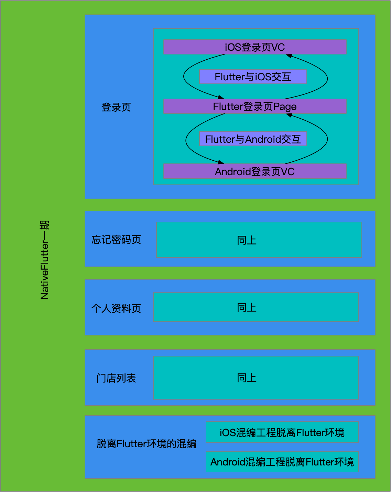
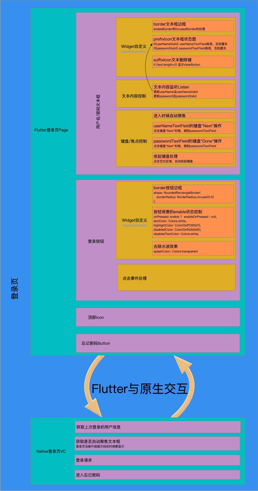

| 需求 | 参与者              |      |
| ---- | ------------------- | ---- |
| 登录 | Flutter的登录页实现 |      |
|      |                     |      |
|      |                     |      |

## 一、需求总览

需求总览大概如下图：

## 二、登录页需求

登录页需求大概如下：

## 三、本期简单归纳

这两周对Flutter在配送端的实践一期目前已结束，实现的内容简单归纳如下：

1、混编方式的升级：

在原有的混编基础上，实现对未安装Flutter环境的编译环境也能够直接运行混编了Flutter的iOS和Android工程，而无需像原本那样必须安装Flutter环境。

2、页面的精确Flutter化：

在Flutter工程中，实现与原生完全一样的登录页、忘记密码、个人中心、门店列表界面，包括各个细节处理，如布局像素、操作效果等，而不仅仅是形式上看着像；

3、原生工程对Flutter界面的接入及替换：

在iOS和Android中接入Flutter实现的界面，实现将原生的界面替换为Flutter界面，从而达到我们的一套界面，两端使用的目的；

4、Widget公共部分的抽取实现：

通过对Widget公共部分的抽取，增加每个接口的代码量及整体代码的可读性，目前采用的是函数方式来实现；

5、交互接口的数据规范制定：

通过对可能的交互的抽象，初步统一原生与Flutter在交互过程中接口的参数规范，同时为今后的接口封装构建基础，避免后续交互接口的大幅变更；并在Wiki中建立规范和形如服务端接口的详细文档，保证了Flutter、iOS、Android各端的交互接口的接入；

6、原生项目(如iOS)对混编时的Channel的进一步封装：

在原生工程中，对Flutter提供的Channel使用进行进一步的封装，实现可只关心结果，而不必像之前那样因交互接口的数据规范的Channel通道交互；

7、Flutter工程对混编时的数据规范封装：

频繁的交互容易导致在对交互数据规范的频繁处理中容易出错，通过对齐进行封装，去除了每次对规范的必须考虑，在形成对数据处理调用的统一时也大大降低出错率；

8、Flutter项目框架的搭建：

对原本每个页面都只有一个dart文件，且所有文件都未有层次区分的工程进行框架的初步搭建，区分通用功能、模块、界面实现、逻辑处理、数据模型、服务、帮助工具等，降低了每个功能代码的复杂度，并减少很多冗余性的代码，让代码看起来更加简洁，同时也让今后的功能开发各组件的归属更明确；

## 四、下期改进计划

现存在的问题，将在接下来做升级和优化处理，主要有：

1、Flutter对Widget公共部分的抽取：

因为Flutter采用的是mixin方式，所以没办法通过先获取到公共的Widget部分，再对个别属性进行定制。目前采用的函数方式，需要考虑进一步改善成可以实现该目的的方式。

2、业务逻辑的完全解耦：

目前Flutter中的业务逻辑Future方法中不免混合进部分视图操作，需要将该部分进行比较完善的解耦；

3、Flutter Channel通道的封装：

目前虽然已经在Flutter中实现了对Channel交互过程中的数据规范做了封装，但Flutter对Channel的调用还是需要调用相应数据规范处理函数，需要为系统的Channel类增加一个封装进数据处理的方法；

4、对Package的开发：

对上述已实现封装的进行打包成Package，方便后续其他工程的使用和避免重复开发；

5、Flutter AOP的调查：

因为视图已交由Flutter实现，原生埋点(如按钮点击)也就无法获取想要的数据，需要调查该需求在Flutter中是如何实现以及可以实现到的地步；

