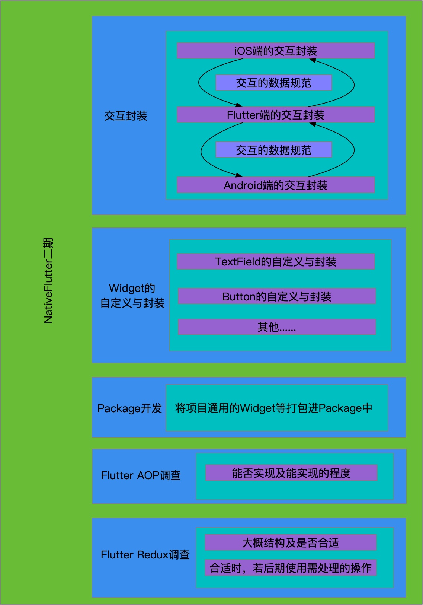
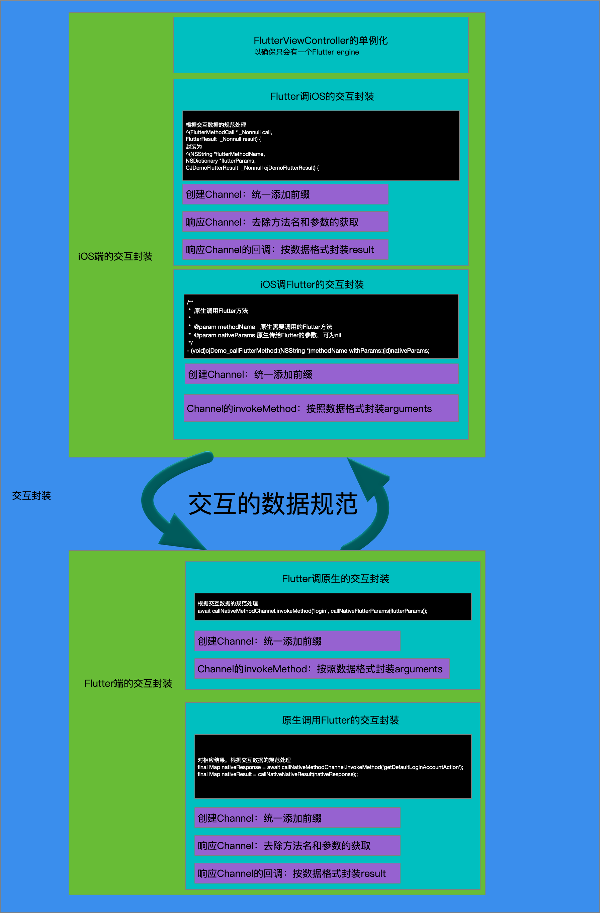

## 一、需求总览

需求总览大概如下图：

## 二、交互封装需求

Flutter与原生的交互封装需求大概如下：

## 三、本期简单归纳

1、Flutter engine的唯一性

在iOS端通过以单例的形式实现FlutterViewController，保证了Flutter engine的唯一。

2、对自定义的Widget进行封装

去除上期使用的函数式自定义Widget，转成与Flutter系统一致的封装风格。

3、对Package的开发：

对上述已实现封装的Widget进行打包成Package，方便后续其他工程的使用和避免重复开发；

4、Flutter项目工程框架的进一步完善

细分各层次操作事项。

5、Flutter AOP的调查

6、Flutter Redux的调查

## 四、下期优化计划

1、Flutter Redux在工程中的使用

2、Flutter AOP的实现

3、Flutter 混合栈的管理

